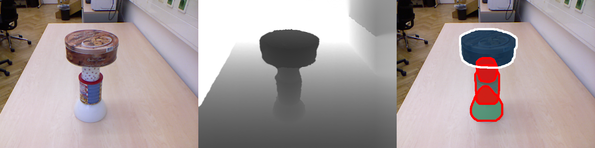

# Unseen Object Amodal Instance Segmentation (UOAIS) v2

This repository contains source codes for the paper **"SynTable: A Synthetic Data Generation Pipeline for Unseen Object Amodal Instance Segmentation of Cluttered Tabletop Scenes"**.

Zhili Ng*, Haozhe Wang*, Zhengshen Zhang*, Francis Eng Hock Tay,  Marcelo H. Ang Jr.
*equal contributions

The source code has added synthetic data evaluation code and Occlusion Order Accuracy (OOACC) implemention to the UOAIS-Net source code from the "Unseen Object Amodal Instance Segmentation via Hierarchical Occlusion Modeling" (ICRA 2022) paper.

[[arXiv]](https://arxiv.org/abs/2307.07333)
[[Website]](https://sites.google.com/view/syntable/home)
[[Dataset]](https://doi.org/10.5281/zenodo.10565517)
[[Demo Video]](https://drive.google.com/file/d/1OXqZoYdOmrCAI1u8CukRNusq2CX_ANV_/view)
[[SynTable Source Code]](https://github.com/ngzhili/SynTable)

## Getting Started

### Environment Setup

Tested on NVIDIA Tesla V100 with python 3.7, pytorch 1.8.0, torchvision 0.9.0, CUDA 10.2 / 11.1 and detectron2 v0.5 / v0.6

1. Download source codes and checkpoints
```
git clone https://github.com/ngzhili/uoais-v2.git
cd uoais
mkdir output
```
2. Download checkpoints at [GDrive](https://drive.google.com/drive/folders/1D5hHFDtgd5RnX__55MmpfOAM83qdGYf0?usp=sharing) 

3. Move the `R50_depth_mlc_occatmask_hom_concat` and `R50_rgbdconcat_mlc_occatmask_hom_concat` to the `output` folder.

4. Move the `rgbd_fg.pth` to the `foreground_segmentation` folder

5. Set up a Python environment
```
conda create -n uoais python=3.8
conda activate uoais
pip install torch torchvision 
pip install shapely torchfile opencv-python pyfastnoisesimd rapidfuzz termcolor
```
Or if you prefer to use a docker container to replicate our results, you can download our docker image at [GDrive](https://drive.google.com/file/d/1nGFHZQYBSOMB4SwdENuGrZVoC7Xuek7i/view?usp=sharing).

Load the docker image by running `docker load < uoais_latest.tar.gz`.

6. Install [detectron2](https://detectron2.readthedocs.io/en/latest/tutorials/install.html)

7. Build custom [AdelaiDet](https://github.com/aim-uofa/AdelaiDet)
```
python setup.py build develop 
```

### Run on sample OSD dataset



```
# UOAIS-Net (RGB-D) + CG-Net (foreground segmentation)
python tools/run_on_OSD.py --use-cgnet --dataset-path ./sample_data --config-file configs/R50_rgbdconcat_mlc_occatmask_hom_concat.yaml

# UOAIS-Net (depth) + CG-Net (foreground segmentation)
python tools/run_on_OSD.py --use-cgnet --dataset-path ./sample_data  --config-file configs/R50_depth_mlc_occatmask_hom_concat.yaml

# UOAIS-Net (RGB-D)
python tools/run_on_OSD.py --dataset-path ./sample_data --config-file configs/R50_rgbdconcat_mlc_occatmask_hom_concat.yaml

# UOAIS-Net (depth)
python tools/run_on_OSD.py --dataset-path ./sample_data --config-file configs/R50_depth_mlc_occatmask_hom_concat.yaml
```

### Run with ROS

1. Realsense D-435 ([realsense-ros](https://github.com/IntelRealSense/realsense-ros) is required.)
```
# launch realsense2 driver
roslaunch realsense2_camera rs_aligned_depth.launch
# launch uoais node
roslaunch uoais uoais_rs_d435.launch 
# or you can use rosrun
rosrun uoais uoais_node.py _mode:="topic"

```

2. Azure Kinect ([Azure_kinect_ROS_Driver](https://github.com/microsoft/Azure_Kinect_ROS_Driver) is required)

```
# launch azure kinect driver
roslaunch azure_kinect_ros_driver driver.launch
# launch uoais node
roslaunch uoais uoais_k4a.launch
```

#### Topics & service
- `/uoais/vis_img` (`sensor_msgs/Image`): visualization results
- `/uoais/results` (`uoais/UOAISResults`): UOAIS-Net predictions (`mode:=topic`)
- `/get_uoais_results` (`uoais/UOAISRequest`): UOAIS-Net predictions (`mode:=service`)

#### Parameters
- `mode` (`string`): running mode of ros node (`topic` or `service`)
- `rgb` (`string`):  topic name of the input rgb
- `depth` (`string`):  topic name of the input depth
- `camera_info` (`string`):  topic name of the input camera info
- `use_cgnet` (`bool`): use CG-Net [1] for foreground segmentation or not 
- `use_planeseg` (`bool`): use RANSAC for plane segmentation or not
- `ransac_threshold` (`float`): max distance a point can be from the plane model


### Run without ROS

1. Realsense D-435 ([librealsense](https://github.com/IntelRealSense/librealsense) and [pyrealsense2](https://pypi.org/project/pyrealsense2/) are required.)

```
# UOAIS-Net (RGB-D) + CG-Net (foreground segmentation)
python tools/rs_demo.py --use-cgnet --config-file configs/R50_rgbdconcat_mlc_occatmask_hom_concat.yaml

# UOAIS-Net (depth) + CG-Net (foreground segmentation)
python tools/rs_demo.py --use-cgnet --config-file configs/R50_depth_mlc_occatmask_hom_concat.yaml

# UOAIS-Net (RGB-D)
python tools/rs_demo.py --config-file configs/R50_rgbdconcat_mlc_occatmask_hom_concat.yaml

# UOAIS-Net (depth)
python tools/rs_demo.py --config-file configs/R50_depth_mlc_occatmask_hom_concat.yaml
```


2. Azure Kinect ([Azure-Kinect-Sensor-SDK](https://github.com/microsoft/Azure-Kinect-Sensor-SDK) and [pyk4a](https://github.com/etiennedub/pyk4a) are required.)

```
# UOAIS-Net (RGB-D) + CG-Net (foreground segmentation)
python tools/k4a_demo.py --use-cgnet --config-file configs/R50_rgbdconcat_mlc_occatmask_hom_concat.yaml

# UOAIS-Net (depth) + CG-Net (foreground segmentation)
python tools/k4a_demo.py --use-cgnet --config-file configs/R50_depth_mlc_occatmask_hom_concat.yaml

# UOAIS-Net (RGB-D)
python tools/k4a_demo.py --config-file configs/R50_rgbdconcat_mlc_occatmask_hom_concat.yaml

# UOAIS-Net (depth)
python tools/k4a_demo.py --config-file configs/R50_depth_mlc_occatmask_hom_concat.yaml
```


## Train & Evaluation

### Dataset Preparation

1. Download `UOAIS-Sim.zip` and `OSD-Amodal-annotations.zip` at [GDrive](https://drive.google.com/drive/folders/1D5hHFDtgd5RnX__55MmpfOAM83qdGYf0?usp=sharing) 
2. Download `OSD-0.2-depth.zip` at [OSD](https://www.acin.tuwien.ac.at/vision-for-robotics/software-tools/osd/). [2]
4. Download `OCID dataset` at [OCID](https://www.acin.tuwien.ac.at/en/vision-for-robotics/software-tools/object-clutter-indoor-dataset/). [3]
5. Extract the downloaded datasets and organize the folders as follows
```
uoais
├── output
└── datasets
       ├── OCID-dataset # for evaluation on indoor scenes
       │     └──ARID10
       │     └──ARID20
       │     └──YCB10
       ├── OSD-0.20-depth # for evaluation on tabletop scenes
       │     └──amodal_annotation # OSD-amodal
       │     └──annotation
       │     └──disparity
       │     └──image_color
       │     └──occlusion_annotation # OSD-amodal
       └── UOAIS-Sim # for training
              └──annotations
              └──train
              └──val
```

### Train different models on UOAIS-Sim
```
# UOAIS-Net (RGB-D) 
python train_net.py --config-file configs/R50_rgbdconcat_mlc_occatmask_hom_concat.yaml

# UOAIS-Net (depth) 
python train_net.py --config-file configs/R50_depth_mlc_occatmask_hom_concat.yaml 

# Amodal-MRCNN (RGB-D)
python train_net.py --config-file configs/R50_rgbdconcat_amodalmrcnn_concat.yaml

# ASN
python train_net.py --config-file configs/R50_rgbdconcat_asn7.yaml

# AMRCNN
python train_net.py --config-file configs/R50_rgbdconcat_syntable_rerun_AMRCNN.yaml

```

## Evaluation on OSD dataset (SynTable paper)

Model Training configurations in SynTable paper can be found under ```./configs_experiments```.

Pre-requisties:

1. Download SynTable paper's model checkpoints in **experiment_model_weights** zip folder from [Zenodo](https://doi.org/10.5281/zenodo.10565517).

2. Unzip **experiment_model_weights** folder and move the **output** folder into uoais-v2 base directory

3. Now, you can run the evaluation codes below:

#### Exp 1: Models trained with no crop, no augmentation, no distortion 
```
# Training Dataset: UOAIS-SIM (tabletop) (25K)
python eval/eval_on_OSD.py --config-file configs_experiments/R50_rgbdconcat_mlc_occatmask_hom_concat_uoais_sim_tabletop_1.yaml --gpu 1

# Training Dataset: SynTable-Half-SIM (25K)
python eval/eval_on_OSD.py --config-file configs_experiments/R50_rgbdconcat_mlc_occatmask_hom_concat_syntable_sim_0.5x_1.yaml --gpu 2

# Training Dataset: SynTable-SIM (50K)
python eval/eval_on_OSD.py --config-file configs_experiments/R50_rgbdconcat_mlc_occatmask_hom_concat_syntable_sim_1.yaml --gpu 3

```

#### Exp 2: Models trained with crop = 0.8, no augmentation, no distortion 
```
# Training Dataset: UOAIS-SIM (tabletop) (25K)
python eval/eval_on_OSD.py --config-file configs_experiments/R50_rgbdconcat_mlc_occatmask_hom_concat_uoais_sim_tabletop_2.yaml --gpu 1

# Training Dataset: SynTable-Half-SIM (25K)
python eval/eval_on_OSD.py --config-file configs_experiments/R50_rgbdconcat_mlc_occatmask_hom_concat_syntable_sim_0.5x_2.yaml --gpu 2

# Training Dataset: SynTable-SIM (50K)
python eval/eval_on_OSD.py --config-file configs_experiments/R50_rgbdconcat_mlc_occatmask_hom_concat_syntable_sim_2.yaml --gpu 3

```

#### Exp 3: Models trained with crop = 0.8, default augmentation, default distortion
```
# Training Dataset: UOAIS-SIM (tabletop) (25K)
python eval/eval_on_OSD.py --config-file configs_experiments/R50_rgbdconcat_mlc_occatmask_hom_concat_uoais_sim_tabletop_3.yaml --gpu 1

# Training Dataset: SynTable-Half-SIM (25K)
python eval/eval_on_OSD.py --config-file configs_experiments/R50_rgbdconcat_mlc_occatmask_hom_concat_syntable_sim_0.5x_3.yaml --gpu 2

# Training Dataset: SynTable-SIM (50K)
python eval/eval_on_OSD.py --config-file configs_experiments/R50_rgbdconcat_mlc_occatmask_hom_concat_syntable_sim_3.yaml --gpu 3

```
#### Exp 4: Models trained with default crop = 0.5, default augmentation, default distortion
```
# Training Dataset: UOAIS-SIM (tabletop) (25K)
python eval/eval_on_OSD.py --config-file configs_experiments/R50_rgbdconcat_mlc_occatmask_hom_concat_uoais_sim_tabletop_4.yaml --gpu 1

# Training Dataset: SynTable-Half-SIM (25K)
python eval/eval_on_OSD.py --config-file configs_experiments/R50_rgbdconcat_mlc_occatmask_hom_concat_syntable_sim_0.5x_4.yaml --gpu 2

# Training Dataset: SynTable-SIM (50K)
python eval/eval_on_OSD.py --config-file configs_experiments/R50_rgbdconcat_mlc_occatmask_hom_concat_syntable_sim_4.yaml --gpu 3

```

## Evaluation on OCID dataset

```
# UOAIS-Net (RGB-D)
python eval/eval_on_OCID.py --config-file configs/R50_rgbdconcat_mlc_occatmask_hom_concat.yaml
# UOAIS-Net (depth)
python eval/eval_on_OCID.py --config-file configs/R50_depth_mlc_occatmask_hom_concat.yaml
```

## Evaluation on Synthetic Datasets (UOAIS-SIM, SynTable-SIM)
```
# Training Dataset: UOAIS-SIM (tabletop) (25K), No Augmentation
python eval/eval_on_synthetic_data.py --config-file configs/R50_rgbdconcat_mlc_occatmask_hom_concat_uoais_sim_tabletop_1.yaml --gpu 1

# Training Dataset: SynTable-SIM (50K), No Augmentation
python eval/eval_on_synthetic_data.py --config-file configs/R50_rgbdconcat_mlc_occatmask_hom_concat_syntable_sim_1.yaml --gpu 2

# Training Dataset: UOAIS-SIM (tabletop) (25K), Default Augmentation
python eval/eval_on_synthetic_data.py --config-file configs/R50_rgbdconcat_mlc_occatmask_hom_concat_uoais_sim_tabletop_4.yaml --gpu 1

# Training Dataset: SynTable-SIM (50K), Default Augmentation
python eval/eval_on_synthetic_data.py --config-file configs/R50_rgbdconcat_mlc_occatmask_hom_concat_syntable_sim_4.yaml --gpu 2
```


## License
The source code of this repository is released only for academic use. See the [license](./LICENSE.md) file for details.

## Acknowledgement
The codes of this repository are built upon open sources. We like to thank the authors for their work and sharing their code.

This repository contain source codes that have been heavily referenced from the original ["Unseen Object Amodal Instance Segmentation via Hierarchical Occlusion Modeling" (ICRA 2022) paper](https://github.com/gist-ailab/uoais).


# **Citation**
If you find our work useful for your research, please consider citing the following BibTeX entry:
```
@misc{ng2023syntable,
      title={SynTable: A Synthetic Data Generation Pipeline for Unseen Object Amodal Instance Segmentation of Cluttered Tabletop Scenes}, 
      author={Zhili Ng and Haozhe Wang and Zhengshen Zhang and Francis Tay Eng Hock and Marcelo H. Ang Jr au2},
      year={2023},
      eprint={2307.07333},
      archivePrefix={arXiv},
      primaryClass={cs.CV}
}
```
Please also cite the original UOAIS-Net paper:
```
@inproceedings{back2022unseen,
  title={Unseen object amodal instance segmentation via hierarchical occlusion modeling},
  author={Back, Seunghyeok and Lee, Joosoon and Kim, Taewon and Noh, Sangjun and Kang, Raeyoung and Bak, Seongho and Lee, Kyoobin},
  booktitle={2022 International Conference on Robotics and Automation (ICRA)},
  pages={5085--5092},
  year={2022},
  organization={IEEE}
}
```
